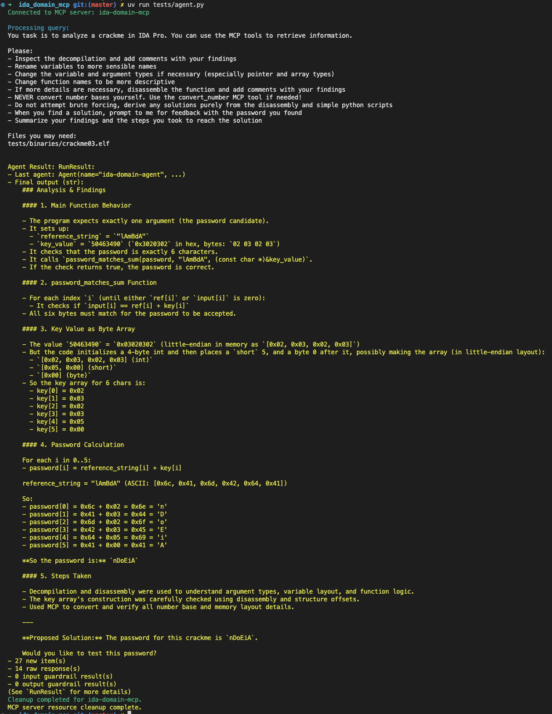
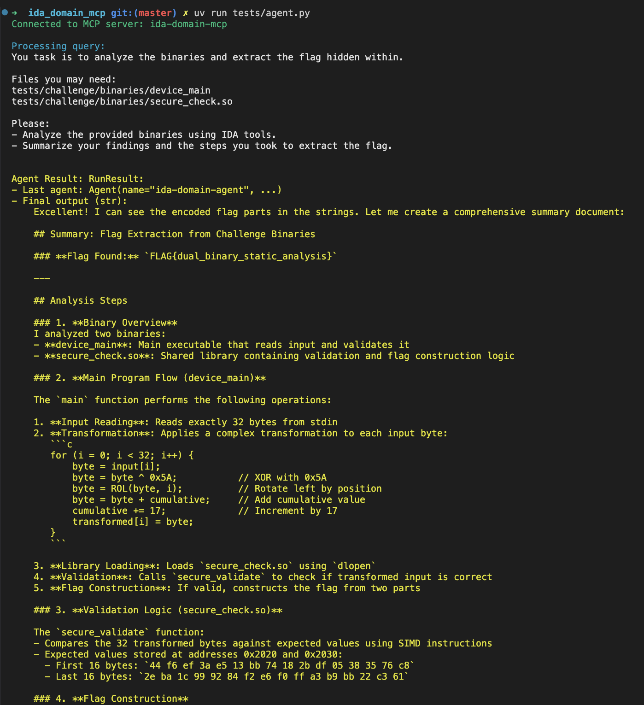
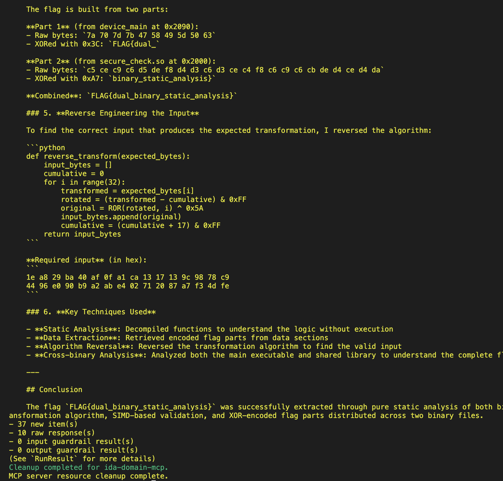

# ida-domain-mcp

A headless Model Context Protocol (MCP) server for IDA Pro built on top of `ida-domain` and `ida-pro-mcp`. It lets AI agents (or any MCP client) open and analyze IDA databases on demand — without launching the IDA manully — and control common reverse engineering workflows programmatically.

Unlike GUI-centric approaches, ida-domain-mcp spins up per-project worker processes on demand and loads binaries via an MCP tool call during the agent's workflow. You don't have to pre-load binaries at MCP server startup, and once configured, the whole flow can run fully automatically without human interaction.

## Example

<!--  -->



## Why it's different

- Headless by design: No dependency on the IDA graphical UI. Uses IDA's headless runners underneath via `ida-domain`.
- On-demand database loading: Call the `open_database` MCP tool at any time during the agent session to load a binary or IDB; no manual preloading required.
- Multi-project isolation: Each `project_name` runs in its own worker process; multiple binaries can be analyzed concurrently without interfering with each other.

## Features (tools)

High-level categories of tools exposed via MCP:
- Project/session management: `open_database`, `close_database`
- IDB/Core: `idb_meta`, `lookup_funcs`, `cursor_addr`, `cursor_func`, `list_funcs`, `list_globals`, `imports`, `strings`, `segments`, `local_types`, `int_convert`
- Analysis & Xrefs: `decompile`, `disasm`, `xrefs_to`, `xrefs_to_field`, `callees`, `callers`, `entrypoints`, `analyze_funcs`, `find_bytes`, `find_insns`, `basic_blocks`, `find_paths`, `search`, `find_insn_operands`, `export_funcs`, `callgraph`, `xref_matrix`, `analyze_strings`
- Debugger: `dbg_start`, `dbg_exit`, `dbg_continue`, `dbg_run_to`, `dbg_step_into`, `dbg_step_over`, `dbg_list_bps`, `dbg_add_bp`, `dbg_delete_bp`, `dbg_enable_bp`, `dbg_regs`, `dbg_regs_thread`, `dbg_regs_cur`, `dbg_gpregs_thread`, `dbg_current_gpregs`, `dbg_regs_for_thread`, `dbg_current_regs`, `dbg_callstack`, `dbg_read_mem`, `dbg_write_mem`
- Memory & Patch: `get_bytes`, `get_u8`, `get_u16`, `get_u32`, `get_u64`, `get_string`, `get_global_value`, `patch`
- Types & Structs: `declare_type`, `apply_types`, `infer_types`, `structs`, `struct_info`, `read_struct`, `search_structs`, `stack_frame`, `declare_stack`, `delete_stack`
- Python: `py_eval`

Most MCP tools here are thin wrappers around upstream ida_pro_mcp modules (core/analysis/debug/memory/modify/stack/types/python) and kept synchronized in functionality, parameters, and return formats. However, project/session management tools (`open_database`, `close_database`) are implemented locally for per-project process orchestration. See the source in [ida_domain_mcp/src/ida_domain_mcp/main.py](ida_domain_mcp/src/ida_domain_mcp/main.py) and [ida_domain_mcp/src/ida_domain_mcp/ida_tools.py](ida_domain_mcp/src/ida_domain_mcp/ida_tools.py) for the bindings, and [ida-pro-mcp/src/ida_pro_mcp/ida_mcp](ida-pro-mcp/src/ida_pro_mcp/ida_mcp) for upstream implementations.

## Requirements

- Python: 3.12+
- IDA: IDA Pro 9.1.0 or later installed.
- uv is recommended for Python package and project management. See [uv documentation](https://docs.astral.sh/uv/) for installation instructions.

## Environment Variables

Configure the executable path according to [`ida-domain`'s documentation](https://ida-domain.docs.hex-rays.com/getting_started/#step-3-verify-installation).
```sh
export IDADIR="[IDA Installation Directory]"
```
Headless executables (`idat`/`idat64`) must be available in the specified IDA installation directory.

## Installation

**Make sure to set up the environment variable as described above before running the MCP server.**

### Run with `uvx`

The simplest way to run the MCP server without installing anything is via `uvx`:

```sh
uvx ida-domain-mcp --transport http://127.0.0.1:8744
```

### Install from PyPI

You can install the package as a dependency of your project from PyPI:

```sh
# With uv
uv init
uv add ida-domain-mcp
# Or with pip
pip install ida-domain-mcp
```

## Running the MCP server

Two transport modes are supported by the server entrypoint `ida-domain-mcp`:

1. stdio (default, for direct MCP client integration)
    ```sh
    uv run ida-domain-mcp --transport stdio
    ```

2. SSE or Streamable HTTP (useful with the MCP Inspector and remote clients)
    ```sh
    # sse at http://127.0.0.1:8744/sse
    uv run ida-domain-mcp --transport http://127.0.0.1:8744
    # streamable http at http://127.0.0.1:8744/mcp
    uv run ida-domain-mcp --transport http://127.0.0.1:8744 --streamable-http
    ```

    You can then connect with the MCP Inspector for quick exploration:

    ```sh
    npx @modelcontextprotocol/inspector
    # Point it to: http://127.0.0.1:8744/sse (SSE) or http://127.0.0.1:8744/mcp (Streamable HTTP)
    ```

## Testing

Clone the repository and install the dependencies:

```sh
git clone https://github.com/xxyyue/ida_domain_mcp
cd ida_domain_mcp
uv sync
```

A simple dual-database test is provided:

```sh
# Start the server first (SSE mode)
uv run ida-domain-mcp --transport http://127.0.0.1:8744

# In another shell, run the test client
uv run tests/test_ida_mcp.py http://127.0.0.1:8744/sse
# Or, run the test agent
echo "OPENAI_API_KEY=sk-..." > .env
uv run tests/agent.py
```
